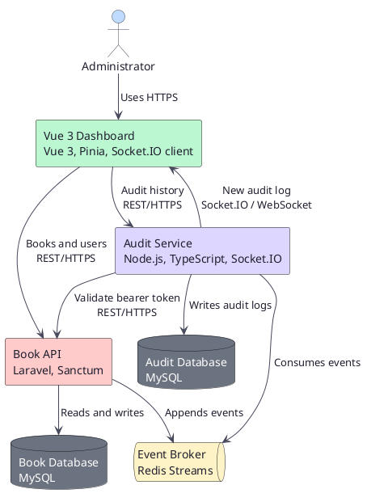
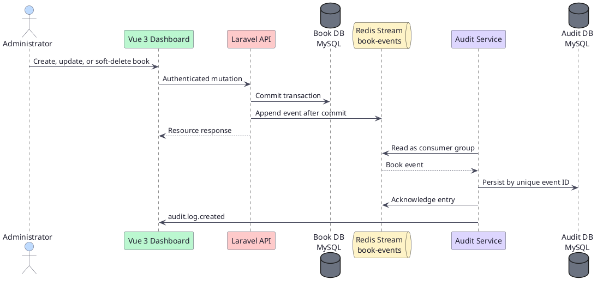
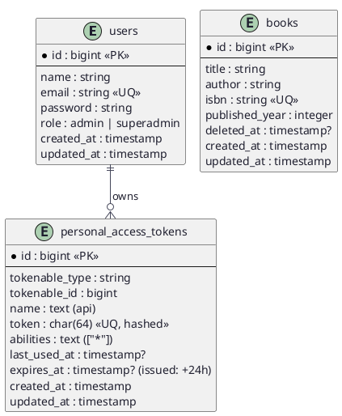
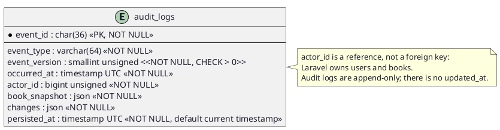

# Architecture

## System context



## Mutation flow



## Data model

### Book database (MySQL)



### Audit database (MySQL)



## Boundaries

| Component | Owns | Does not own |
| --- | --- | --- |
| Laravel API | users, books, Policies, mutation events | audit logs or WebSockets |
| Audit service | events, audit logs, real-time notifications | books, users, book database |
| Vue | interface and local state | business rules or databases |
| Redis Streams | event transport | system-of-record data |

### Audit-service structure

The Node.js Audit service uses hexagonal architecture. Its domain and application layers define audit-event data and use cases without importing HTTP, Redis, MySQL, Socket.IO, or environment APIs. Ports are interfaces owned by those layers; infrastructure adapters implement them for MySQL persistence, Redis Stream consumption, Laravel token validation, and Socket.IO notification. The composition root is the only place that reads configuration and wires adapters to use cases. This permits the same persistence use case to be invoked by the upcoming Redis adapter, while later HTTP and Socket.IO adapters remain independent delivery mechanisms.

## Integration rules

- Laravel uses MySQL and Sanctum bearer tokens; the audit service owns a separate MySQL database.
- Laravel and the MySQL server use UTC; both Book and Audit database timestamps use this shared server timezone.
- Redis DB `0` contains Laravel cache keys, DB `1` contains local application event streams, and DB `2` is the isolated test event broker. Laravel appends v1 Book events to Redis Stream `book-events` after commit and approximately trims entries older than one day. Stream fields are scalar: `event_id`, `event_type`, `event_version`, and `occurred_at` are strings; `actor`, `book`, and `changes` are JSON strings decoded by the audit service.
- Redis Streams is the event queue: the audit service creates consumer group `audit-service` at `0-0` for `book-events`, so its first startup processes every retained entry. It claims up to 10 pending entries idle for at least 60 seconds with `XAUTOCLAIM` before each read, then reads up to 10 new entries with `XREADGROUP`, blocking for up to 5 seconds. It persists each entry and only then calls `XACK`. Each running audit-service instance uses its own consumer name; duplicate delivery is safe because `event_id` is unique in `audit_logs`.
- Compose uses health checks and ignored environment files for secrets. MySQL and Redis use their standard ports on the local development host for optional database and Redis visualizers.

### Audit-service authentication

- Vue sends the Sanctum bearer token in the `Authorization` header to Laravel and the audit-history endpoint.
- For every audit-history request, the audit service forwards that header to Laravel's internal `GET /api/v1/me` endpoint. It returns `401` unless Laravel confirms the token.
- For the Socket.IO handshake, Vue sends the complete bearer authorization value through `auth.authorization`, not a query parameter. The audit service forwards it unchanged to Laravel and accepts the connection only when Laravel confirms it.
- Each accepted Socket.IO connection has a maximum 15-minute lifetime, then must reconnect and complete a fresh Laravel validation. A Laravel logout therefore prevents new connections immediately and ends an already-open connection within at most 15 minutes.
- The audit service retains no bearer token or user session state after the handshake; it does not issue, persist, inspect, or cache Sanctum tokens.

## API contract — v1

All REST endpoints are versioned under `/api/v1` and use JSON. Protected calls send `Authorization: Bearer <token>`. The implemented request and response schemas live in the root `openapi.yaml` contract and are updated with each endpoint.

| Method | Path | Access | Purpose |
| --- | --- | --- | --- |
| POST | `/auth/register` | Public | Register an `admin` and return a 24-hour Sanctum bearer token. |
| POST | `/auth/login` | Public | Return a new 24-hour Sanctum bearer token. |
| POST | `/auth/logout` | Authenticated | Revoke the current token. |
| GET | `/me` | Authenticated | Laravel: return the current user and role; audit service uses it internally to validate bearer tokens. |
| GET, POST | `/books` | Authenticated | List active books; create a book. |
| GET, PATCH, DELETE | `/books/{id}` | Authenticated | Read, update, or soft-delete a book. |
| GET | `/users` | Superadmin | List users. |
| GET | `/audit-logs` | Authenticated | Audit service: validate the bearer token with Laravel, then return paginated persisted audit logs. |

Book write fields are `title`, `author`, `isbn`, and `published_year`. Laravel returns API Resources. API errors use JSON: `401`, `403`, `404`, and `500` return only a stable `message` (`Unauthenticated.`, `Forbidden.`, `Resource not found.`, or `Server error.`); `422` retains Laravel's `message` and field-level `errors`. Internal error details remain in server logs.

Audit history uses the same list parameter names as Books: `page`, `per_page`, `search`, `sort_by`, and `sort_direction`. Its search is a trimmed, case-insensitive contains match over `event_type` and `event_id`; sortable fields are `event_type`, `event_id`, `actor_id`, and `occurred_at`. Without a requested sort it remains ordered by `occurred_at DESC`, then `persisted_at DESC`, then `event_id DESC`.

## Event contract — v1

Laravel appends this JSON message to Redis Stream `book-events` after the MySQL transaction commits:

```json
{
  "event_id": "uuid",
  "event_type": "book.created",
  "event_version": 1,
  "occurred_at": "2026-07-27T12:00:00Z",
  "actor": { "id": 1 },
  "book": {
    "id": 42,
    "title": "Example title",
    "author": "Example author",
    "isbn": "9780000000000",
    "published_year": 2026
  },
  "changes": {}
}
```

- `event_type` is `book.created`, `book.updated`, or `book.deleted`; the last represents a soft deletion.
- `changes` records before/after values for updates and `deleted_at` for deletion.
- The audit-service mapping is direct: `event_id`, `event_type`, `event_version`, and `occurred_at` map to their same-named columns; `actor.id` maps to `actor_id`; `book` maps to `book_snapshot`; `changes` maps to `changes`; and the audit service assigns `persisted_at` after its insert succeeds.
- The audit service uses `event_id` as the `audit_logs` primary key. After a new insert, it reads the exact persisted record, broadcasts `audit.log.created` to all currently authorized Socket.IO clients, then acknowledges the Stream entry. Duplicate deliveries are acknowledged but never broadcast. Socket.IO delivery is best-effort: a notification failure does not prevent acknowledgement, and the audit-history endpoint is the recovery path after a disconnect or missed event.
- `audit.log.created` has the same object schema and UTC second-precision timestamps as the `AuditLog` response schema: `event_id`, `event_type`, `event_version`, `occurred_at`, `actor_id`, `book_snapshot`, `changes`, and `persisted_at`.
- Incompatible changes require a new event version; v1 remains supported until its consumers are removed.
