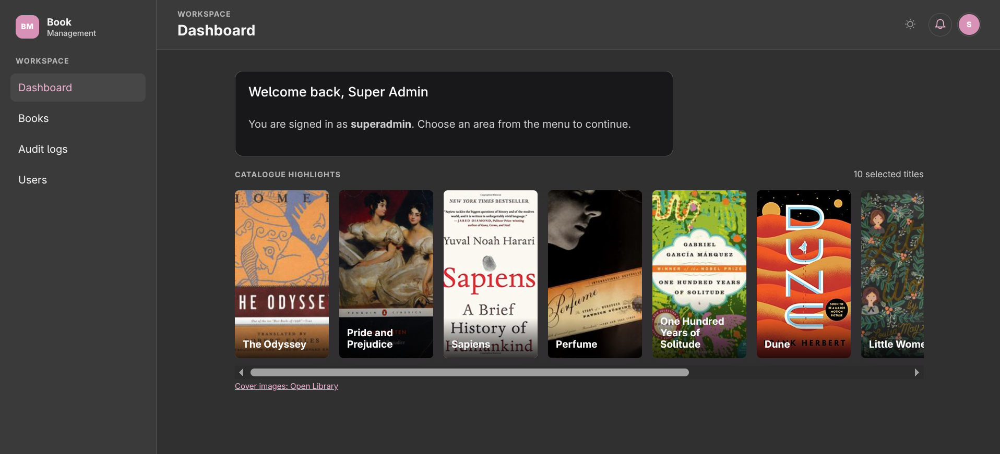

# Book Management System



## English

Local book management dashboard with users, immutable audit history, and live notifications.

### Run locally

**Requirement:** Docker Engine or Docker Desktop with the Compose plugin.

```sh
cp .env.example .env
# Set SUPERADMIN_EMAIL and SUPERADMIN_PASSWORD in .env
make up
make exec SERVICE=backend CMD='php artisan migrate --seed'
make exec SERVICE=backend CMD='php artisan users:provision-superadmin'
```

Open <http://localhost:5174> and sign in with the `SUPERADMIN_EMAIL` and `SUPERADMIN_PASSWORD` values from the root `.env`. The seed command creates 25 sample books.

### Test accounts and configuration

Set the local test superadmin in the root `.env` before provisioning it:

```dotenv
SUPERADMIN_EMAIL=your-superadmin@example.test
SUPERADMIN_PASSWORD=choose-a-local-password
```

This account has full access to test books, audit history, and user listing. Register through the dashboard to create an `admin` account; roles cannot be changed through the API.

### Services and commands

| Service | Address |
| --- | --- |
| Vue dashboard | <http://localhost:5174> |
| Laravel API | <http://localhost:8000> |
| Audit health | <http://localhost:3000/health> |
| MySQL / Redis | `127.0.0.1:3306` / `127.0.0.1:6379` |

```sh
make ps
make logs
make down
make check          # Laravel: Pint, PHPStan, PHPUnit
make audit-check    # Audit service: lint, typecheck, Node tests
make frontend-check # Frontend: Prettier, ESLint, vue-tsc, build
make exec SERVICE=backend CMD='php artisan books:import-open-library --subject=science_fiction --limit=10'
```

The last command imports more development books from Open Library.

### Architecture explanation

I designed this as a Docker Compose monorepo with clear data ownership: Laravel owns users and books, while the Audit service owns audit logs. A book change follows one path: Vue calls Laravel, Laravel commits to MySQL and publishes to Redis Streams, the Audit service stores the event once, then notifies connected dashboards through Socket.IO.

Key decisions:

- **Reliable audit trail:** Redis Streams decouples audit work from book writes; the unique event ID makes retries safe.
- **One security authority:** Laravel Sanctum issues and validates bearer tokens. Laravel Policies enforce access; frontend checks only shape the interface.
- **Isolated data:** each service can access only its own MySQL database, including isolated test databases.

| Container | Approach | Security, data, and quality |
| --- | --- | --- |
| Vue dashboard | Vue 3 SPA with TypeScript, Vue Router, Pinia, and Socket.IO. | Pinia retains the bearer token and local notifications. Prettier, ESLint, `vue-tsc`, and Vite validate the frontend. |
| Laravel API | Versioned REST API for users and books. | Sanctum and Policies protect endpoints; Laravel owns `books`. Pint, PHPStan, and PHPUnit cover backend quality. |
| Audit service | Node.js/TypeScript service with hexagonal boundaries around HTTP, Redis, MySQL, and Socket.IO adapters. | It delegates token validation to Laravel, owns `audit`, and uses Node's test runner with strict linting and type checks. |
| MySQL and Redis | One local MySQL container provides separate service and test databases; Redis Streams carries events. | Redis DB 1 is local event transport and DB 2 is reserved for isolated tests. |

See [Architecture](ARCHITECTURE.md), [project scope](PROJECT.md), and the [OpenAPI contract](openapi.yaml) for more details.

For Development, I worked alongside Codex, specialized skills, and an adapted Ralph-inspired workflow. Human Final review per feature and architecture decisions remained under my ownership.

---

## Español

Dashboard local para administrar libros y usuarios, con historial de auditoría inmutable y notificaciones en tiempo real.

### Ejecutar localmente

**Requisito:** Docker Engine o Docker Desktop con el plugin Compose.

```sh
cp .env.example .env
# Configura SUPERADMIN_EMAIL y SUPERADMIN_PASSWORD en .env
make up
make exec SERVICE=backend CMD='php artisan migrate --seed'
make exec SERVICE=backend CMD='php artisan users:provision-superadmin'
```

Abre <http://localhost:5174> e inicia sesión con los valores `SUPERADMIN_EMAIL` y `SUPERADMIN_PASSWORD` del `.env` principal. El seeder crea 25 libros de ejemplo.

### Credenciales de prueba y configuración

Define las credenciales del superadmin de prueba en el `.env` principal:

```dotenv
SUPERADMIN_EMAIL=your-superadmin@example.test
SUPERADMIN_PASSWORD=choose-a-local-password
```

Esta cuenta tiene acceso completo para probar libros, audit logs y listado de usuarios. Desde el login/register se pueden creare nuevos usuarios del tipo `admin`; los roles no se modifican mediante la API.

### Servicios y comandos

| Servicio | Dirección |
| --- | --- |
| Vue dashboard | <http://localhost:5174> |
| Laravel API | <http://localhost:8000> |
| Health Audit-service | <http://localhost:3000/health> |
| MySQL / Redis | `127.0.0.1:3306` / `127.0.0.1:6379` |

```sh
make ps
make logs
make down
make check          # Laravel: Pint, PHPStan, PHPUnit
make audit-check    # Auditoría: lint, typecheck, pruebas Node
make frontend-check # Frontend: Prettier, ESLint, vue-tsc, build
make exec SERVICE=backend CMD='php artisan books:import-open-library --subject=science_fiction --limit=10'
```

El último comando importa más libros desde Open Library.

### Arquitectura explicada

Diseñé el proyecto como un monorepositorio con Docker Compose y teniendo claras las responsabilidades sobre los datos: Laravel es dueño de usuarios y libros, mientras que el audit-service es dueño de los logs. Una mutación de un libro sigue una sola ruta: Vue llama a Laravel, Laravel persiste en MySQL y publica en Redis Streams, el audit-service guarda el evento una vez y después notifica por Socket.IO a los dashboards conectados, en este caso Vue.

Decisiones principales:

- **Auditoría confiable:** Redis Streams desacopla cualquier mutación de los libros; el id del evento es único y hace seguros los reintentos.
- **Una autoridad de seguridad:** Laravel Sanctum emite y valida bearer tokens. Laravel Policies aplica accesos específicos (permisos); el frontend solo define la interfaz con base en los datos del backend.
- **Datos aislados:** cada servicio accede únicamente a su propia base MySQL, incluidas las bases aisladas para testing.

| Contenedor | Enfoque | Seguridad, datos y calidad |
| --- | --- | --- |
| Vue Dashboard | SPA Vue 3 con TypeScript, Vue Router, Pinia y Socket.IO. | Pinia conserva el bearer token y las notificaciones locales. Prettier, ESLint, `vue-tsc` y Vite validan el frontend. |
| API Laravel | API REST versionada para usuarios y libros. | Sanctum y Policies protegen los endpoints; Laravel es dueño de `books`. Pint, PHPStan y PHPUnit cuidan la calidad del backend. |
| Servicio de auditoría | Servicio Node.js/TypeScript con límites hexagonales entre adaptadores HTTP, Redis, MySQL y Socket.IO. | Delega la validación del token a Laravel, es dueño de `audit` y usa el runner de pruebas de Node con lint y type checks estrictos. |
| MySQL y Redis | Un contenedor MySQL local ofrece bases separadas por servicio y pruebas; Redis Streams transporta eventos. | Redis DB 1 es el que transporta los eventos y DB 2 se reserva para testing. |

Consultar la [arquitectura](ARCHITECTURE.md), el [alcance](PROJECT.md) y el [contrato de OpenAPI](openapi.yaml) para más detalle.

Para el desarrollo, trabajé junto a Codex, custom skills y un flujo inspirado y adaptado al principio de Ralph Wiggum. La revisión final de cada funcionalidad y las decisiones de arquitectura permanecieron bajo mi responsabilidad.
